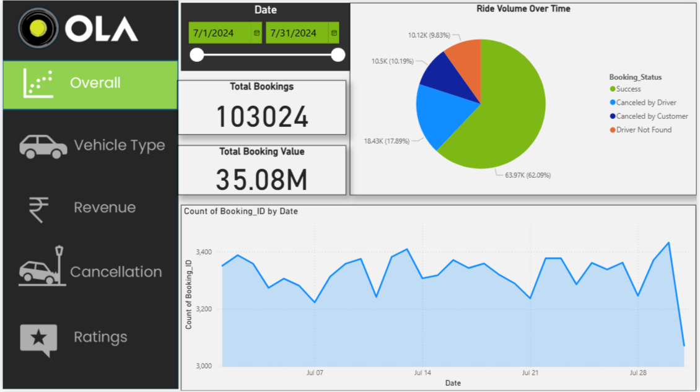
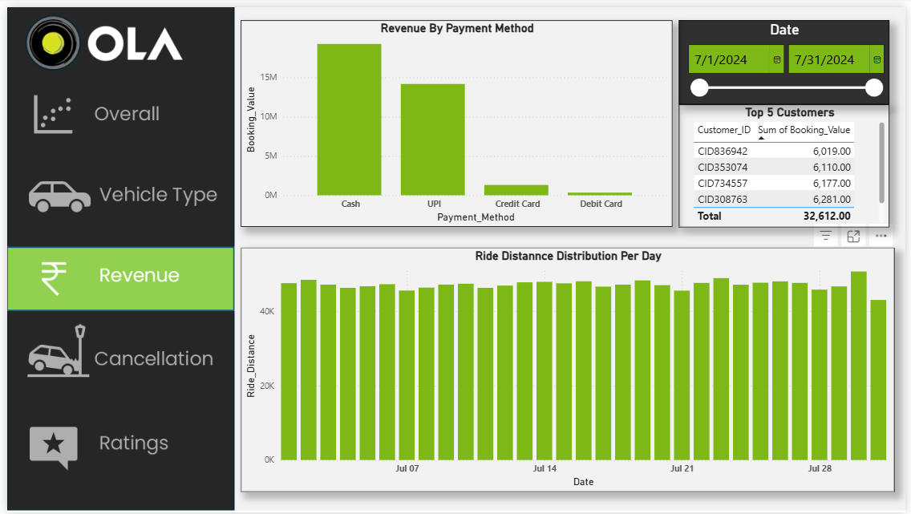
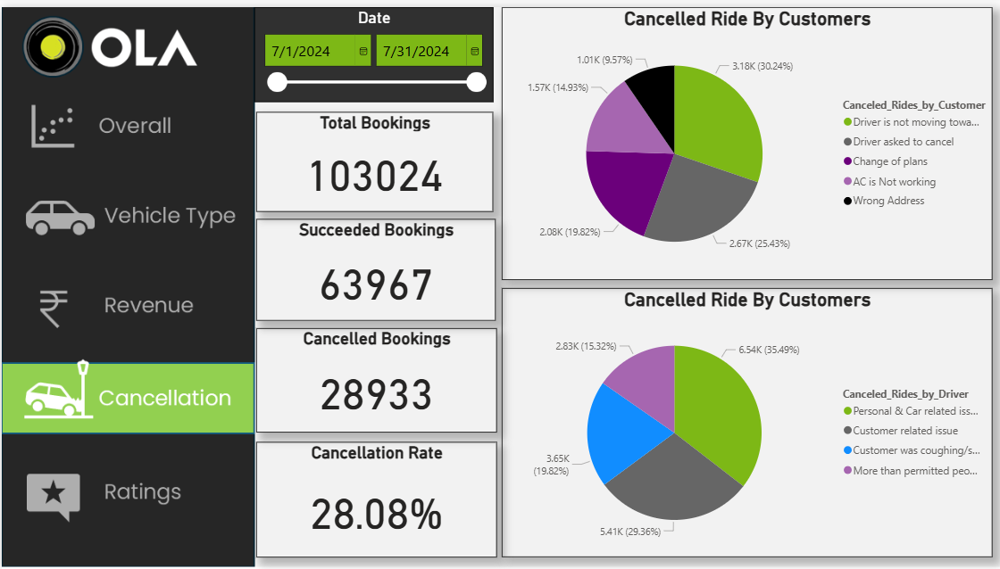
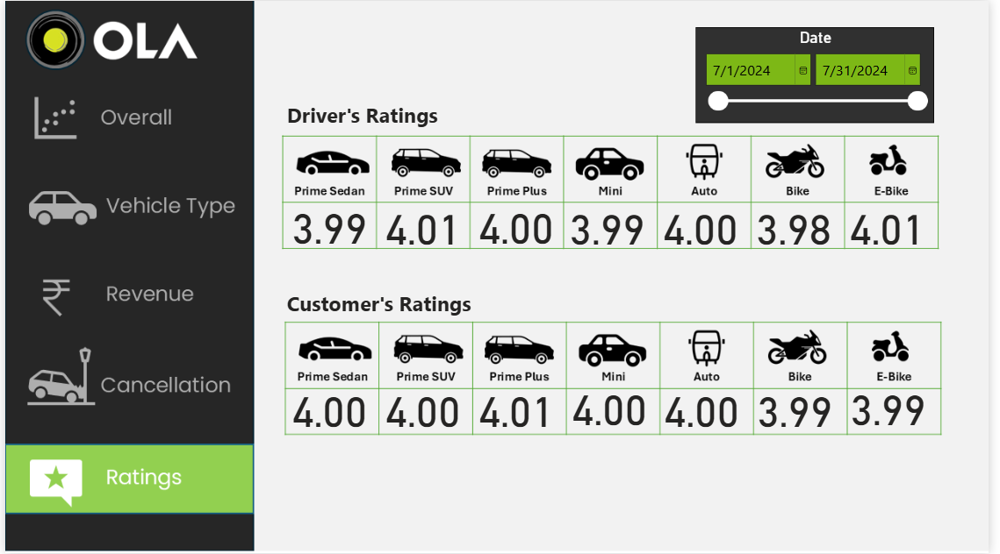

# 🚖 Ola Ride Analytics Dashboard (Power BI)

### 🔹 Overall Dashboard  

### 🔹 Vehicle Type Analysis  

### 🔹 Revenue Analysis  

### 🔹 Cancellation Insights  

### 🔹 Ratings Overview  

## 📌 Project Overview

This project presents an **interactive Power BI dashboard** built on Ola ride-hailing data.
The dashboard provides a **360° view of operations** including **bookings, revenue, cancellations, ratings, and vehicle performance**.

Ride-hailing platforms like Ola face challenges such as:

* High cancellation rates (both customer & driver side).
* Tracking revenue across multiple payment methods.
* Understanding customer & driver satisfaction.
* Identifying top-performing vehicle types.

This dashboard solves these problems by **transforming raw booking data into actionable insights**.

---

## 🎯 Problem Statement

Ola, like any ride-hailing platform, generates **huge volumes of data daily**. However, raw data without analysis does not answer critical questions:

* How many bookings were actually successful vs. canceled?
* Which reasons drive **customer or driver cancellations**?
* What is the **impact of different vehicle types** on revenue and distance traveled?
* How do **payment methods** contribute to total revenue?
* Are customers and drivers satisfied (ratings comparison)?

This project aims to **uncover these insights in a visual, easy-to-digest format** for data-driven decision-making.

---

## 📊 Dashboard Features

### 🔹 **Overall Insights**

* Total bookings, successful rides, cancellations, and booking value.
* Ride volume distribution by booking status (Success, Canceled by Driver/Customer, Driver Not Found).
* Trend of daily bookings.

### 🔹 **Vehicle Type Analysis**

* Total vs. successful booking value by vehicle type.
* Average & total ride distance per vehicle.
* Revenue performance of Prime Sedan, SUV, Mini, Auto, Bike & E-Bike.

### 🔹 **Revenue Analysis**

* Revenue split by **payment method** (Cash, UPI, Credit/Debit Card).
* Top 5 high-value customers.
* Ride distance distribution per day.

### 🔹 **Cancellation Analysis**

* Cancellation rate (%) and reasons for customer & driver cancellations.
* Insights into operational inefficiencies (e.g., wrong address, car/driver issues).

### 🔹 **Ratings Analysis**

* Comparison of **driver ratings vs. customer ratings** across all vehicle types.
* Identifies gaps in service quality perception.

---

## 🗂 Dataset Description

The dataset contains ride-level details with the following columns:

| Column Name                       | Description                                                            |
| --------------------------------- | ---------------------------------------------------------------------- |
| **Date**                          | Ride booking date                                                      |
| **Time**                          | Booking time                                                           |
| **Booking\_ID**                   | Unique booking identifier                                              |
| **Booking\_Status**               | Success / Canceled by Driver / Canceled by Customer / Driver Not Found |
| **Customer\_ID**                  | Unique customer identifier                                             |
| **Vehicle\_Type**                 | Prime Sedan, SUV, Mini, Auto, Bike, E-Bike                             |
| **Pickup\_Location**              | Ride starting location                                                 |
| **Drop\_Location**                | Ride destination                                                       |
| **V\_TAT**                        | Vehicle Turnaround Time                                                |
| **C\_TAT**                        | Customer Waiting Time                                                  |
| **Canceled\_Rides\_by\_Customer** | Reason if canceled by customer                                         |
| **Canceled\_Rides\_by\_Driver**   | Reason if canceled by driver                                           |
| **Incomplete\_Rides**             | Flag for incomplete rides                                              |
| **Incomplete\_Rides\_Reason**     | Reason for incomplete ride                                             |
| **Booking\_Value**                | Revenue from the ride                                                  |
| **Payment\_Method**               | Cash / UPI / Credit Card / Debit Card                                  |
| **Ride\_Distance**                | Distance traveled in ride (km)                                         |
| **Driver\_Ratings**               | Rating given by driver to customer                                     |
| **Customer\_Rating**              | Rating given by customer to driver                                     |

---

## 🧠 What I Learned

Through this project, I gained strong hands-on experience in:
✔ Data cleaning & transformation for BI tools.
✔ Creating calculated measures (e.g., cancellation rate, booking success %).
✔ Building **interactive dashboards** with slicers, filters & drill-downs.
✔ Visual storytelling – turning raw numbers into insights for business users.
✔ Understanding **ride-hailing business KPIs** (utilization, cancellations, customer behavior).

---

## 🚀 Tech Stack

* **Power BI** – Dashboarding & Data Visualization
* **Excel/CSV** – Data Source
* **DAX** – Measures & calculated columns

---

## 📢 Conclusion

This project demonstrates how **Power BI can transform ride-hailing data into powerful insights** for decision-making.
With this, Ola (or any ride-hailing company) can:

* Reduce cancellations by targeting root causes.
* Improve driver & customer satisfaction.
* Optimize vehicle allocation.
* Track revenue and customer behavior effectively.

---

